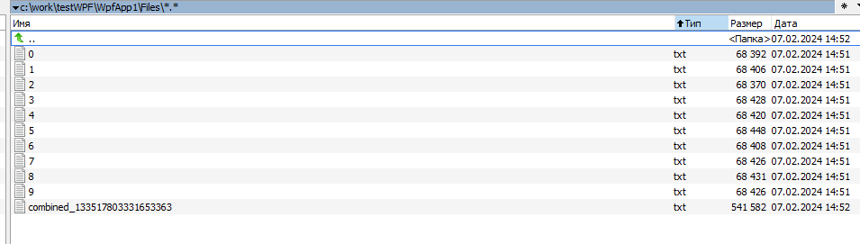

# Test WPF application

Оба тестовых задания выполнены в рамках одного WPF-приложения.

Приложение состоит из 2х tab-control страниц (для 1го и 2го задания соответственно).

Первое задание: генерация файлов, их содержимого, работа с файлами, работа с базой данных.
---

- Код реализации генератора текстовых файлов для задания 1.1 ([_Generator.cs_](./WpfApp1/WpfApp1/Logic/Generator.cs))
- Код реализации объединения файлов для задания 1.2 ([_Combinator.cs_](./WpfApp1/WpfApp1/Logic/Combinator.cs))
- Код реализации импортирования содержимого в БД для задания 1.3 ([_DBImporter.cs_](./WpfApp1/WpfApp1/Logic/DBImporter.cs))
- [_Скрипты_](./task1-3.sql) БД для задания 1
---

Второе задание: работа с данными, excel-файлами, базой данных.
---

- Код реализации считывания данных из excel файла и их сохранения в БД ([_ExcelImporter.cs_](./WpfApp1/WpfApp1/Logic/ExcelImporter.cs))
- Код реализации отображения файлов и их содержимого из БД ([_ExcelExporter.cs_](./WpfApp1/WpfApp1/Logic/ExcelExporter.cs))
- Код работы с WPF ([_MainWindow_](./WpfApp1/WpfApp1/MainWindow.xaml.cs))
- [_Скрипты_](./task2.sql) БД для задания 2
---
# Изображения:

Диаграмма БД:

Скриншоты интерфейса:

